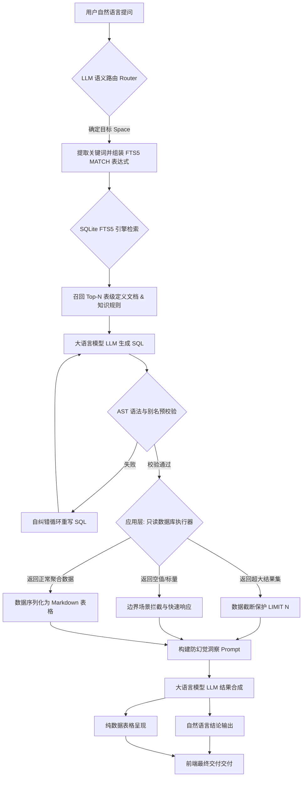

# 软件开发设计文档：基于 SQLite FTS5 的全链路 Text-to-Insight 数据智能体架构

## 1. 方案背景与目标
在企业级数据查询场景中，单纯的 Text-to-SQL 只是中间环节，真正的业务闭环需要实现从“理解自然语言”到“准确查询数据”，再到“生成人类可读的业务洞察”（Text-to-Insight / ChatBI）。

本方案在原有“基于 SQLite FTS5 确定性检索”的 Text-to-SQL 架构基础上，向后延伸构建了完整的数据智能体（Data Agent）链路。通过引入“聚合下推”、“结果集防溢出”以及“防幻觉数据总结”等工程防呆策略，打造一个高精确度、轻量级、且极具落地价值的端到端问答系统。

## 2. 总体架构设计

系统采用 4 个阶段（Phase）的流水线架构，涵盖意图路由、SQL 生成、数据执行与洞察生成。

## 3. 逻辑分层与数据源设计 (三层架构)

系统采用 **Database -> Space -> Table** 的三层架构，兼顾物理连通与逻辑隔离。

1. **Database (物理数据源层):** 对应底层的业务数据库实例。用户在前端界面选定，确保同一会话下的所有表具备原生的 JOIN 能力。
2. **Space (业务域隔离层):** 按业务线（如 HR、Sales）对表进行逻辑分组。每个 Space 配置 `description` 和 `sample questions`。通过前置 LLM 路由匹配目标 Space，大幅降低无关表的上下文干扰。
3. **Table (原子索引层):** 以单张表为单位，在 SQLite 中建立 FTS5 全文索引。

## 4. 核心模块详细设计

### 4.1 阶段一：索引与检索 (Phase 1: Retrieval)
* **表级文档化 (Table-as-Document):** 将 DDL 转化为结构化“知识块”，包含：技术/业务表名、表用途、列详细定义、关键枚举值映射。
* **分词策略:** 采用零外部依赖的 CJK 2-gram + 连续汉字全词混合发射，确保对业务名词（如“净利润”）的精确匹配。
* **安全路由与检索:** LLM 仅负责空间路由和提取检索词，由后端代码转义并拼接合法的 FTS5 语法（如 `MATCH 'space_tags:Sales AND (订单 OR order*)'`），防止 SQL 注入。

### 4.2 阶段二：生成与校验 (Phase 2: Text-to-SQL)
* **别名强制约束 (Pre-assigned Aliases):** 在表级文档中预先分配表别名（如 `sales_orders` -> `so`）。通过 System Prompt 强制要求所有 JOIN 查询必须携带前缀，杜绝 `ambiguous column name` 错误。
* **AST 预校验与自纠错:** 利用轻量级 SQL 解析库（如 `sqlglot`）在内存中拦截缺乏前缀的野字段。遇错则附带 Error Stack 回传给 LLM 触发 Self-Correction。

### 4.3 阶段三：数据执行与防护 (Phase 3: Execution)
这是系统从生成向执行过渡的核心安全网：
* **聚合下推策略 (Pushdown Aggregation):** 强指令约束 LLM 尽可能在 SQL 层面完成统计运算（`SUM`, `AVG`, `GROUP BY`），禁止拉取全量明细数据。
* **结果集防溢出 (Context Blowup Protection):** 在数据库执行器中强制拼接或设置阈值（如 `LIMIT 50`）。超出部分截断，并传递 `is_truncated = True` 信号给下游。
* **极值拦截:** 
    * 若返回 0 条记录，直接短路回复“未找到符合条件的数据”。
    * 若返回单行单列的标量值（如 `COUNT(*)` = 42），执行极简处理链路。

### 4.4 阶段四：洞察生成与交付 (Phase 4: Insight Generation)
* **轻量化数据序列化:** 将数据库 ResultSet 转化为高信息密度的 Markdown 表格或紧凑 CSV 格式，极大节约 LLM 的 Token 消耗。
* **防幻觉 Prompt 设定 (Anti-Hallucination):** 剥夺 LLM 的自我发挥权，确立三大核心纪律：
    1. 绝对忠实于提取的数据，禁止引入外部知识。
    2. 严禁进行二次数学计算（加减乘除或比率计算）。
    3. 若数据被截断，必须在回答末尾声明：“因数据量较大，此处仅展示前 N 条，建议增加过滤条件。”

## 5. 项目交付与演进规划
* **当前版本 (MVP):** 专注于核心链路的准确性。最终交付形态为“1-2 句核心业务结论 + 结构化 Markdown 表格”。
* **未来演进 (V2.0):** 
    * 引入轻量级 `sqlite-vec` 实现全文/向量混合检索。
    * 在阶段四实现双轨输出（Dual-Track Output），由 LLM 同步生成标准化图表（ECharts/AntV）的渲染配置 JSON，实现自动化可视化展现。
